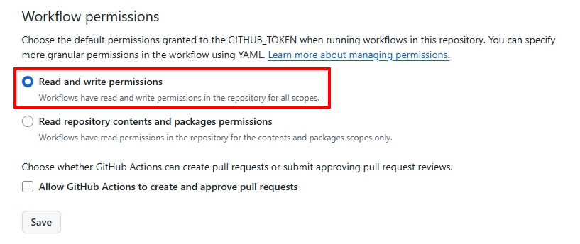
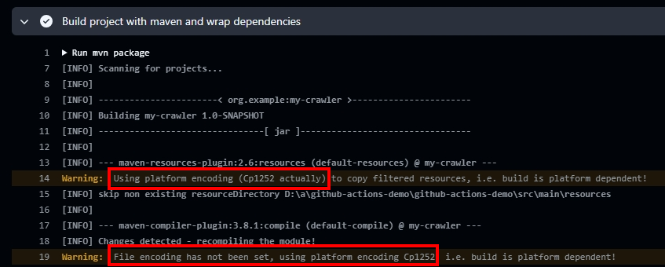

# GitHub Actions Demo

## 目的
使用GitHub Actions實現爬蟲的自動化，排程讓GitHub Actions定期爬取噗浪(Plurk)偷偷說，產生html檔於`github-actions-demo\crawling_data`目錄底下，並於生成後自動提交至repository。

## 結構
- 專案構建工具: Maven
- 環境: Windows, JDK 17
- ``.github\workflows``下的yml
  - 參考文件: [GitHub Actions documentation](https://docs.github.com/en/actions)
    - ``github-actions-demo.yml``: GitHub官方文件提供的Quickstart模板
    - ``crawler-demo.yml``: 爬蟲Plurk偷偷說的workflow
- ``org.example.MyCrawler``
  - 主要的爬蟲程式，main方法入口
  - 使用``java.net.http``的HttpClient發送API請求與接收回傳資料
  - 將資料從json格式轉換為``org.example.pojo.Plurk``與``org.example.pojo.Response``再進行處理
- ``org.example.HtmlConverter``
  - 呼叫``HtmlConverter.saveHtmlToFile()``生成html文件並儲存於``crawling_data``文件夾底下，以``yyyyMMdd.html``日期分開存儲

## 注意事項
- GitHub Actions的``github-actions[bot]``要設置權限，才能推送到自己GitHub repository
  - Repository介面點選 Settings -> Actions -> General -> Workflow permissions，選擇``Read and write permissions``並按下save儲存修改
  
- 如要輸出含中文文字的文件，必須特別設置編碼為``UTF-8``，否則會造成亂碼問題
  - 以此專案為例，GitHub提供virtual machine的Windows環境，默認編碼是``Cp1252``
  
  - 可調整部分:
    1. pom.xml添加以下配置，以強制Maven使用UTF-8：
    ```xml=
    <project>
    ...
      <properties>
      <project.build.sourceEncoding>UTF-8</project.build.sourceEncoding>
      <project.reporting.outputEncoding>UTF-8</project.reporting.outputEncoding>
      </properties>
    ...
    </project>
    ```
    2. 生成的html中須包含這行標籤:
    ```html=
    <meta charset="UTF-8">
    ```
    3. 確保程式中輸出流使用UTF-8編碼
    ```java=
    try (FileWriter writer = new FileWriter(file, StandardCharsets.UTF_8)) {
      writer.write(htmlContent); 
    ...
    } catch (Exception e) {
    ...
    }
    ```
    4. 設定GitHub Actions中環境變數``JAVA_TOOL_OPTIONS``
    ```yaml=
    - name: Set encoding to UTF-8
      run: echo "JAVA_TOOL_OPTIONS=-Dfile.encoding=UTF-8" >> $GITHUB_ENV
    ```